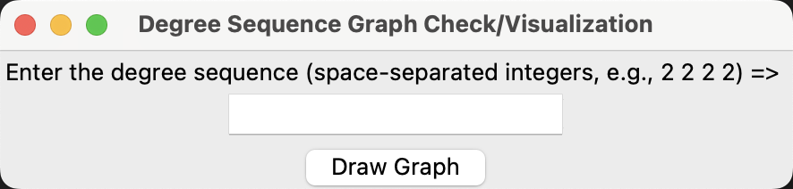
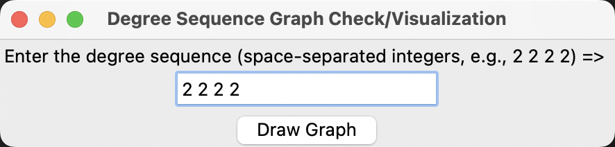
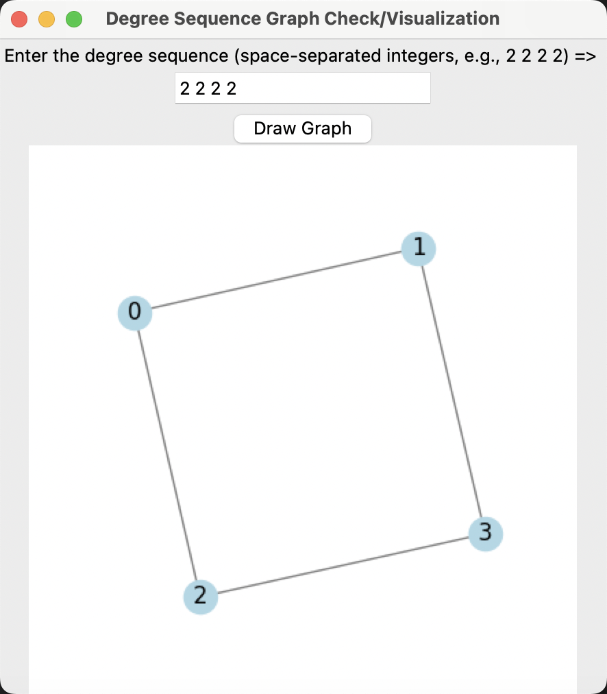
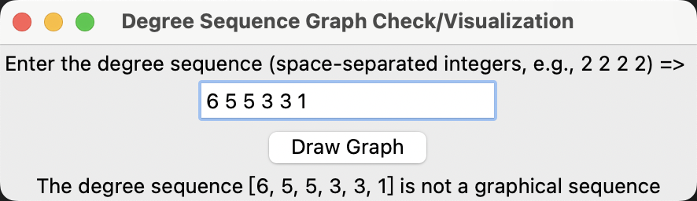
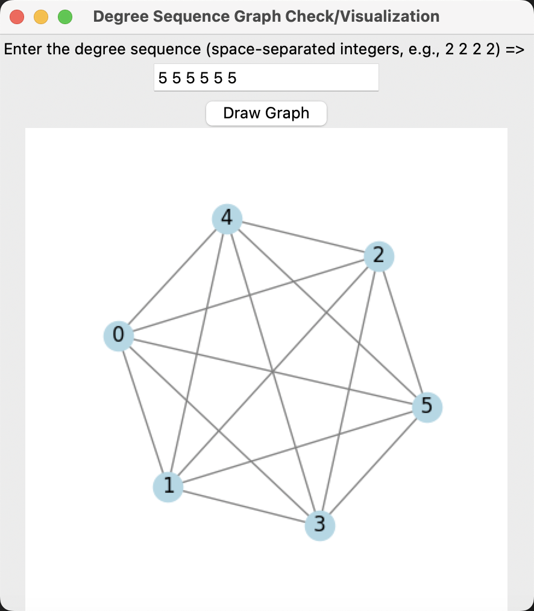

## 1. degree_sequence.py 

### 1.1. Comments

The degree_sequence.py script is used to determine whether a given degree sequence is a graphical sequence based on the Havel-Hakimi theorem. It performs the following tasks:

1. If the sequence is a graphical sequence, it draws the corresponding simple graph.
2. If the sequence is not a graphical sequence, it prints a prompt message.

### 1.2. Execution

