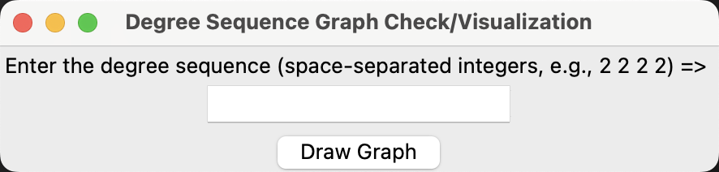
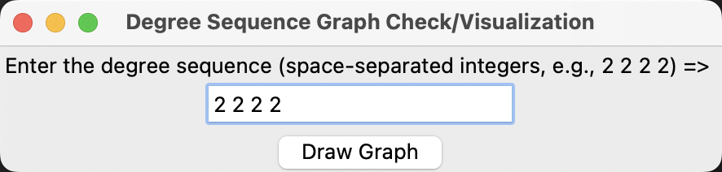
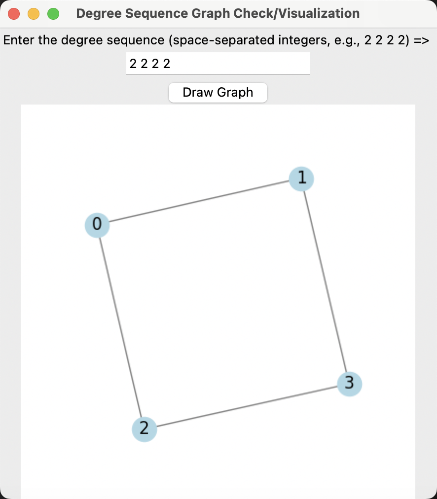
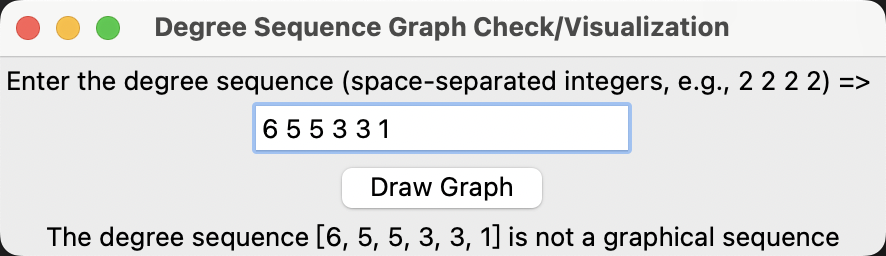

## 1. degree_sequence.py 

### 1.1. 注释（Comments）

脚本 degree_sequence.py，根据 Havel-Hakimi 定理判断给定的度序列是否是一个合理的图的序列，并执行以下任务：

1. 如果度序列是一个图序列，它会绘制对应的简单图。
2. 如果度序列不是一个图序列，它会打印一个错误信息。

The degree_sequence.py script is used to determine whether a given degree sequence is a graphical sequence based on the Havel-Hakimi theorem. It performs the following tasks:

1. If the degree sequence is a graphical sequence, it draws the corresponding simple graph.
2. If the degree sequence is not a graphical sequence, it prints a prompt message.

### 1.2. 执行（Execution）

1. 启动（Run）

2. 输入参数（Input parameter）

3. 绘制合理的简单图（Draw graph correctly）

4. 绘制不合理的图（Draw graph invalid）

5. 绘制合理的简单图（Draw graph correctly）

