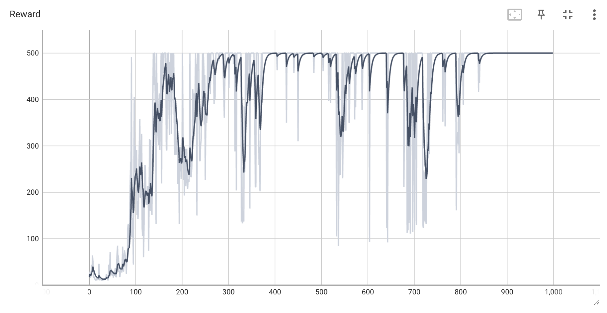
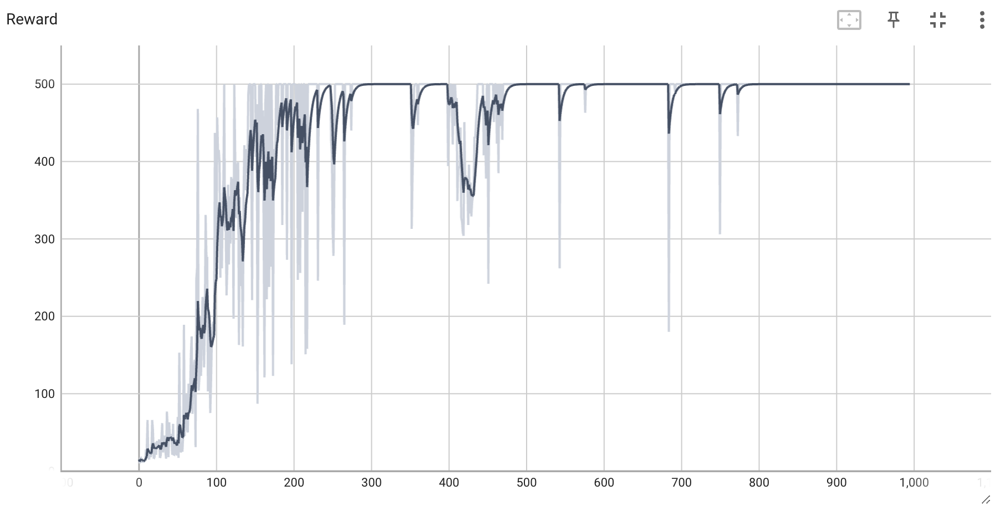

# 在 CartPole-V1 环境中基于 Pytorch 的 PPO 算法实现

## 简介

该程序尽可能简单的实现了近端策略优化（PPO）算法，在 CartPole-V1 环境中训练智能体尽可能的获得更高的奖励。环境的更多细节参考官方文档：[OpenAI-Gym CartPole-V1](https://www.gymlibrary.dev/environments/classic_control/cart_pole/)。

## 主要依赖版本

- Python 3.8.19
- Numpy  1.24.4
- PyTorch 2.2.2
- OpenAI Gym 0.26.2

## 部分实验结果

环境奖励随训练次数的变化曲线

环境奖励随训练次数的变化曲线（学习率衰减）

## 调试中遇到的主要问题

- Advantage 计算存在错误
- Buffer 中收集一批数据后开始训练，训练后未清除使用过的数据
- Learning rate 的设置