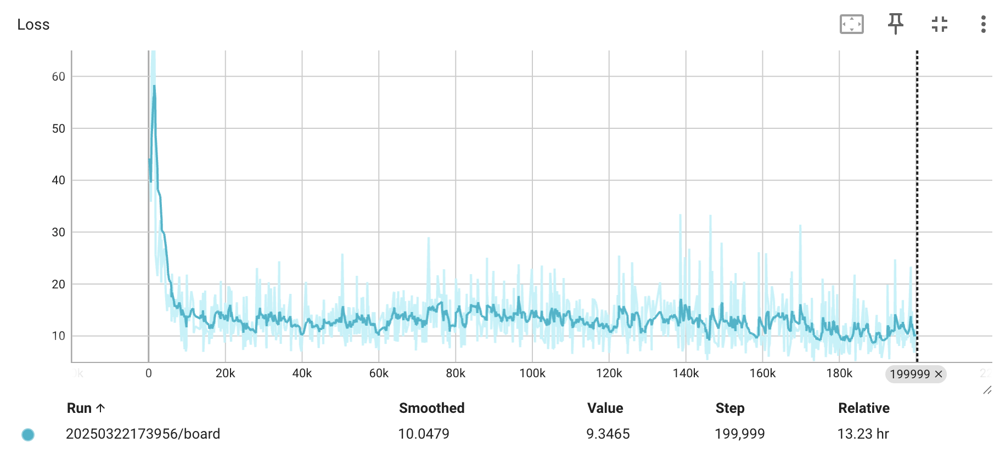
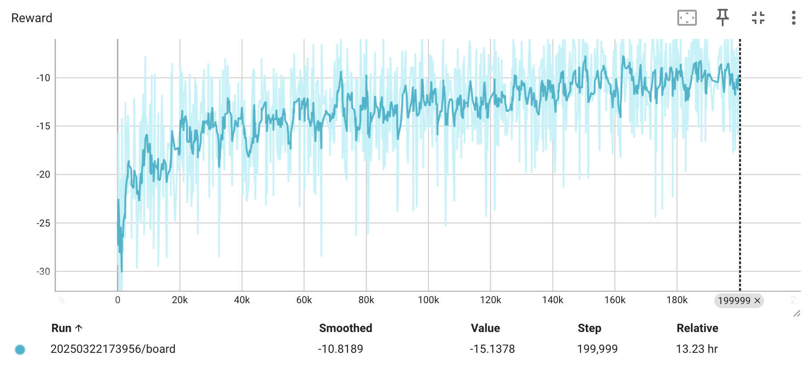
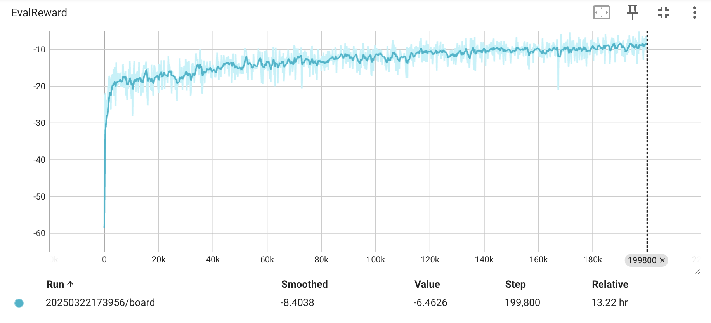
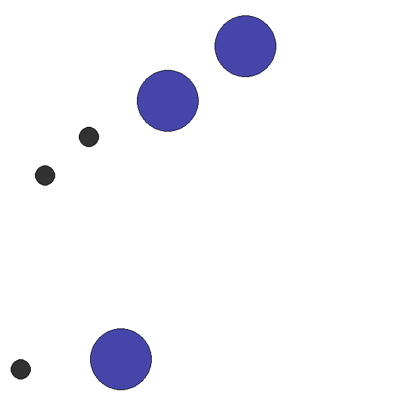

# 在 SimpleSpread-V3 环境中基于 Pytorch 的 MAPPO 算法实现

# 一、简介

该程序尽可能简单的实现了多智能体近端策略优化（MAPPO）算法，在 SimpleSpread-V3 环境中训练智能体尽可能的获得更高的奖励。环境的更多细节参考官方文档：[Pettingzoo SimpleSpread-V3](https://pettingzoo.farama.org/environments/mpe/simple_spread/)。

# 二、主要依赖版本

- Python 3.8.19
- Numpy  1.24.4
- PyTorch 2.2.2
- Pettingzoo 1.24.3
- Imageio 2.35.1

# 三、部分实验结果

## 3.1. Loss & Reward

Actor-Critic Loss 收敛曲线

- x: Training episode
- y: Loss

训练阶段 Reward 变化曲线

- x: Training episode
- y: Environment reward

评估 Reward 变化曲线（在训练过程中定期执行，会取消随机探索）

- x: Eval episode
- y: Environment reward

## 3.2. Env render

训练阶段部分 Episode 环境渲染图

Episode = 100000

Episode = 120000

Episode = 140000

Episode = 160000

Episode = 180000
