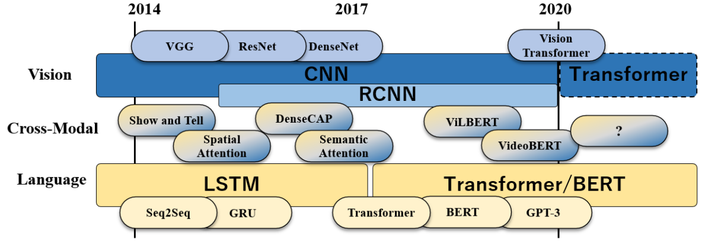
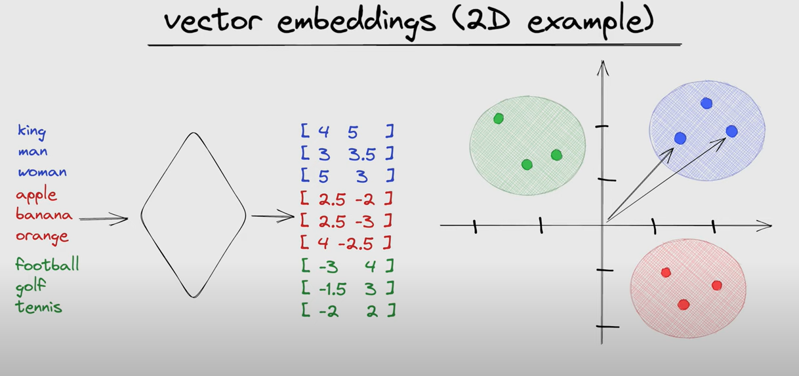
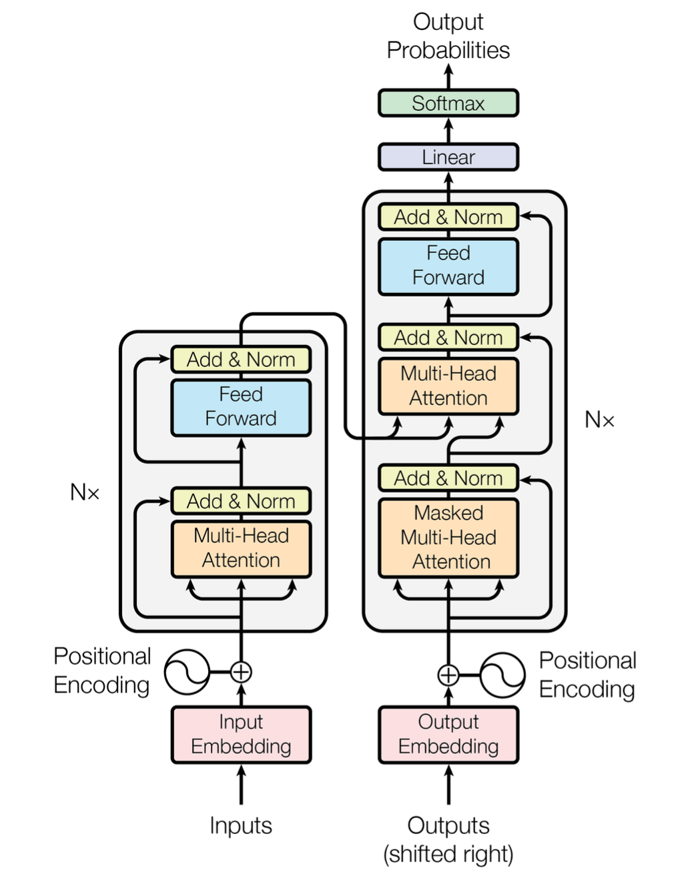
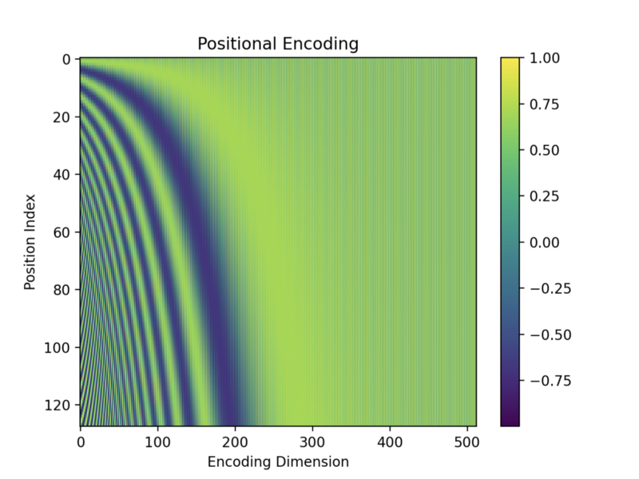

# Transformer (Background, Architecture, Application)

[代码运行的相关文档点击此处](./README.RUN.MD)

# 一、简介

## 1.1. 术语表

## 1.2. 论文

论文链接：[Arxiv - Attention Is All You Need](https://arxiv.org/abs/1706.03762)

发表时间：Vaswani et al. (Google) 于 2017 年发表，2021 年广泛应用于 CV，NLP 领域

论文摘要：基于编码器解码器架构的主流 seq2seq 模型往往依赖于复杂的 RNN 或 CNN 网络。表现更佳的模型还会引入 Attention 机制连接编码器和解码器。本文提出了一个完全基于 Attention 机制的简单网络架构 —— Transformer，该架构不依赖于 RNN 和 CNN 模块。在两个机器翻译任务上的实验表明，这一模型具有更好的表现和更高的并行处理能力，其训练所需的时间也大幅减少。

视频推荐：台大李宏毅老师，自注意力相关的课程，自行搜素

## 1.3. 背景

语言模型是一种人工智能 (AI)，经过训练可以理解和生成人类语言。它们用于各种应用，包括机器翻译、文本摘要、问答和聊天机器人。由 Vaswani 等人在 2017 年提出的 Transformer 是一种简单高效的神经网络架构，它彻底改变了自然语言处理（NLP）领域，目前已成为许多最先进的语言模型的核心架构。

在此之前，传统的序列建模方法（如循环神经网络（RNN）和长短时记忆网络（LSTM））虽然有效，但存在一些限制，如难以并行化处理长距离依赖关系。这些方法通过逐步处理序列中的每个元素来建模上下文信息，因此在处理长序列时效率较低。


*Fig.1 主要模型的时间线，包含视觉领域，语言领域和跨模态领域：[Shin et al](https://ar5iv.labs.arxiv.org/html/2103.04037)*

Transformer 的设计思路是完全摒弃循环结构，其特点：（1）自注意力机制使模型能够捕捉文本中的长距离依赖关系（长文本中的单词关系），实验表明该机制在 NLP 任务中有着卓越的表现；（2）基于编码器解码器架构，通过对编码器和解码器组件进行修改，或是使用不同格式的预训练数据，可以调整基本的 Transformer 架构以适应不同的 NLP 任务。例如 BERT 在 “完形填空” 任务中表现出色，GPT 则展示了卓越的 “写作文” 能力。

## 1.4. Embedding

> Note: 关于 Embedding 的中译，通常会被翻译为 “嵌入”。这个分人吧，反正我感觉对我自己来说不是很好理解，所以后面都会使用 Embedding 来指代这一术语。

什么是 Embedding？其实很好理解，可以类比二进制的概念。计算机并不能理解人类语言，其内部的存储和计算单元均基于电子开关实现，因此需要通过 0 和 1 两个状态实现数据的存储和处理。所有形式的数据文字、图像、音频等都可以转换为一串二进制编码。

神经网络只能处理数值，不能直接对文字进行计算。基于神经网络的 NLP 模型，则需要一种表示形式，将文字等自然语言转化为神经网络可以接受的数值形式，这就叫做 Embedding 或者 Token Embedding。举例来说，“放弃” 这一含义，在自然语言空间中的表示形式可以是一个单词，记作 “abandon”。而在向量空间中的表示形式则是一个 Embedding，可能是 “[-3.5, 2.7, ..., 0.23]”。


*Fig.2 Embedding：[Causewriter.ai - General AI Explainers](https://causewriter.ai/courses/ai-explainers/lessons/vector-embedding/)*

一种简单的实现方法，假如所有英文单词一共有 10000 个（这叫做词汇表大小），则使用一个 10000 维的 0-1 向量，即可表示每一个单词。这种编码方式叫做 One-hot 编码。例如 `abandon = [1, 0, 0, ..., 0]`。但是这种方法无法处理多义词，因为同一个单词的 Embedding 是相同的，即使在句子中的真正含义不同。

还可以使用预训练好的 Word2Vec 模型。Word2Vec 模型接收一个单词的 One-hot 编码并输出一个 N 维浮点向量作为 Embedding。Embedding 的维度是可以自定义的，因为理论上浮点数的表示能力是无限的。

对于 Transformer 来说，输入的文本序列是可以是通过任意一种方式转化为 Embedding 的。可以使用 One-hot 编码，也可以使用 Word2Vec 模型生成。因为 Transformer 本身具备学习输入序列中的词向量表示的能力，它会在训练过程中不断更新 Embedding 的生成策略。实现方式很简单，只需要增加一个随机初始化的 Embedding Table，对输入的初始 Embedding 进行重新映射得到 Token Embedding，并将 Embedding Table 的参数设置为需要梯度即可。

Embedding Table 生成的 Token Embedding 以后，位置编码模块会根据输入序列中单词顺序生成 Positional Embedding，其包含了单词在文本中的位置信息。将 Token Embedding 与 Positional Embedding 加和即可得到输入到网络中的 Embedding。其中，具体的编码细节会在第二章详细介绍。

## 1.5. 网络结构简单看看

下图摘自论文原图。我第一次看到这张图是一脸蒙蔽的，但不能否认确实把网络中的所有关键信息都画出来了。其中包含的主要模块有：
1. 编码器：左边一半，Nx 表示有 N 个相同结构的编码器并行处理
2. 解码器：右边一半，Nx 表示有 N 个相同结构的解码器并行处理
3. 位置编码：Positional Encoding
4. （掩码）自注意力模块：(Masked) Multi-Head Attention
5. 残差连接 & 层归一化：Add & Norm
6. 前馈神经网络：Feed Forward


*Fig.3 Transformer 网络架构：[Arxiv - Attention Is All You Need](https://arxiv.org/abs/1706.03762)*

### 1.5.1. Transformer 的工作流程

作为一个编码器解码器架构的网络模型，通常情况下存在两个不同的应用阶段：（1）训练：在训练阶段，模型通过大量的已标记数据进行学习和优化，以调整模型的参数，使其能够对输入数据进行有效的预测或输出；（2）推理/预测：在推理阶段，会将已经训练好的模型应用于未见过的数据，生成输出。

### 1.5.1. 网络的输入与输出

作为一个深度学习网络模型，Transformer 在做的事情可以简化为一个非线性映射，即 `y = f(x) = relu(w * x + b)`。其中 `x` 表示自然语言的输入，`w, b` 表示可学习的参数，它们对 `x` 执行一个线性变换，`relu` 是一个非线性函数，为模型添加非线性拟合的能力（什么叫拟合？假如我们需要一个机器翻译的功能，我们将其视为一个函数，这个函数接收源语言的文本序列和目标语言两个参数，输出目标语言的文本序列。我们不知道这个函数的实现细节。但多层线性和非线性变换，使得深度神经网络有望接近这一函数，这就是拟合能力的体现。）。

`f(x)` 这一映射将人类的语言空间映射为机器可处理的向量空间。以机器翻译为例，输入到 Transformer 中的内容将包含两部分，它们均是自然语言的序列，但根据模型的工作阶段不同又存在格式上的差异：
1. 训练阶段
    - 编码器输入（Source，源）：<start>Good Morning.<end>
    - 解码器输入（Target，目标）：<start>早上好。<end>
2. 推理阶段
    - 编码器输入：<start>Good Afternoon.<end>
    - 解码器输入：<start>
由于推理阶段，没有针对输入的目标输出，因此只能输入到网络中一个开始标记。训练好的解码器在接收到开始标记后，将根据编码器对源问题的映射结果产生输出，直至

事实上，训练阶段通常都是按照批次进行的，以保证较高的训练效率。也就是说，每次训练都会输入到网络中一批数据：
```
[
    [source, target],
    [source, target],
    ...,
    [source, target]
]
```

### 1.5.2. 位置编码

Transformer 使用位置编码是为了给模型提供输入序列中每个单词的位置信息。由于单纯的注意力机制没有像 RNN 或 CNN 那样显式的顺序处理能力，因此需要一种方式来区分输入序列中单词的所在位置，以便正确捕捉顺序对语义的影响。如何理解注意力机制没有位置信息？因为注意力机制的计算仅依赖于 Embedding 的值，即使将整个句子随机重排列，每个 Embedding 相对于其它 Embedding 的注意力计算结果也不会发生变化。

位置编码常见的实现方式如下所示，本文将仅介绍原论文中的正弦函数编码，具体内容在第二章：
- 绝对位置编码
  - 正余弦位置编码：Transformer 原文中使用
  - 可学习绝对位置编码：BERT，GPT，ViT
- 相对位置编码
  - 经典相对位置编码：HUAWEI NEZHA，
  - 旋转位置编码：LLAMA，QWen


### 1.5.3. 自注意力机制

自注意力机制是 Transformer 网络的核心部分，主要用于捕捉输入序列中不同位置单词的依赖关系，从而有效地编码和解码序列信息。将其理解为一个函数的话，其接受 N 个 Embedding（输入序列）作为输入，并输出 N 个叠加了注意力信息的 Embedding。因此，其本质就是在按照某种算法计算输入的多个 Embedding 之间的某种关系。

而对于多头自注意力中的 “头”，是指并行计算多组注意力权重的机制。具体来说，每个注意力头都会独立地学习一组映射关系，并计算出一组注意力权重，最终将这些权重合并起来形成最终的输出。多头注意力可以进一步增强模型的泛化能力。

Trnasformer 中使用了带有掩码的自注意力机制，“掩码” 可以让注意力机制在计算时屏蔽一些不希望参与计算的信息。总体来讲，按照屏蔽内容的不同可以将掩码分为两类：（1）填充掩码（Padding Mask）：在处理批次中的序列数据时，批次中每个序列的长度可能不同（跟 GPT 对话 10 次，每次问题的长度可能都不一样，为了便于计算，序列会被填充至长度相等，则每个序列中可能会包含数量不等的无效信息），掩码需要将填充信息屏蔽，使得注意力机制只关注实际的有效输入；（2）前瞻掩码/序列掩码（Look-ahead Mask，Sequence Mask）：在自回归模型的训练阶段，前瞻掩码用于防止模型观测到未来的信息。训练阶段，在计算某个位置的 Embedding 对应的注意力信息时，Decoder 应该只关注该位置之前的所有信息，而不能看到该位置以后的信息。如果没有前瞻掩码屏蔽未来信息，模型在训练阶段很可能会直接抄袭目标输出，从而实现零误差。但在测试阶段该模型将无法工作，因为没有目标输出给模型作参考。

### 1.5.4. 残差连接

残差网络是深度学习中一种被验证为十分有效的辅助技术，可帮助解决深层神经网络训练过程中的梯度消失和梯度爆炸问题。对残差网络感兴趣的可阅 Kaiming He 的论文：[Arxiv - Deep Residual Learning for Image Recognition](https://arxiv.org/abs/1512.03385)。由于 Transformer 中残差部分的使用比较简单，这里将不再赘述，细节部分可以直接参考源码实现。

### 1.5.5. 层归一化

### 1.5.6. 前馈神经网络

# 二、Embedding

## 2.1. Token Embedding

Transformer 使用随机初始化的 Embedding Table 实现对单词的编码，其接收一个 One-hot 编码，返回一个固定大小的 Token Embedding。基于 PyTorch 实现的 Token Embedding 代码如下所示：

```
# PART OF TRANSFORMER
class TokenEmbedding(nn.Embedding):
    def __init__(self, vocab_size, d_model):
        """
        Parameter
        ----------
        vocab_size: 词汇表的大小，即最多有多少个单词
        d_model: 每个 Embedding 向量的维度
        """
        super(TokenEmbedding, self).__init__(num_embeddings=vocab_size, embedding_dim=d_model)
```

## 2.2. Positional Embedding

假如一个 Transformer 网络每次能处理的文本序列最大长度不超过 `max_len`（一次输入最多包含的单词数），这意味着每个单词的位置将在 `pos = {0, 1, ..., max_len-1}` 之中取值。正余弦位置编码考虑为每一个位置生成一个独特的向量，称作 Position Embedding (PE)，其维度与 Token Embedding (TE) 相同，假设该维度为 `d_model`。将 PE 理解为一个二维矩阵，则针对每一个位置，定义如下位置编码计算公式：
```
PE(pos, 2i) = sin(pos / (10000^(2i / d_model)))
PE(pos, 2i+1) = cos(pos / (10000^(2i / d_model)))

# pos: 表示二维矩阵的每一行
# 2i, 2i+1: 表示二维矩阵的每一列，按照奇偶位置使用不同公式计算
```


*Fig.4 正余弦位置编码（`max_len = 128, d_model = 512` 对应的正余弦位置编码表，是一个形状为 `max_len * d_model` 的二维矩阵，其中每一行表示一个位置编码）：[Transformer’s Positional Encoding](https://kikaben.com/transformers-positional-encoding/)*

以上图为例，则 `pos = 1` 对应的 PE 可表示为一个 512 维的向量，其计算可安装 `d_model` 的奇偶位置分为两部分：
```
PE(1) = [
    PE(pos, 0) = sin(1 / (10000^(0 / 512)),
    PE(pos, 1) = cos(1 / (10000^(0 / 512)),
    PE(pos, 2) = sin(1 / (10000^(2 / 512)),
    PE(pos, 3) = cos(1 / (10000^(2 / 512)),
    ...,
    PE(pos, 510) = sin(1 / (10000^(510 / 512)),
    PE(pos, 511) = cos(1 / (10000^(510 / 512))
]
```

位置编码模块的目标是生成一个位置编码表，其形状为 max_len * d_model。位置编码表中每一行表示一个位置（1 ~ max_len）对应的位置编码。基于 PyTorch 实现的 Positional Embedding 如下所示：

```
# PART OF TRANSFORMER
class PositionalEmbedding(nn.Module):

    def __init__(self, d_model, max_len):
        """
        Parameter
        ----------
        d_model: 模型使用的 Embedding 的维度
        max_len: 模型允许的输入序列最大长度
        """
        super(PositionalEmbedding, self).__init__()
        embedding_table = torch.zeros(max_len, d_model, dtype=torch.float32, requires_grad=False)
        pos = torch.arange(start=0, end=max_len, dtype=torch.float32).unsqueeze(1)
        _2i = torch.arange(start=0, end=d_model, step=2, dtype=torch.float32)
        embedding_table[:, 0::2] = torch.sin(pos / (10000 ** (_2i / d_model)))
        embedding_table[:, 1::2] = torch.cos(pos / (10000 ** (_2i / d_model)))
        self.embedding_table = embedding_table

    def forward(self, x):
        """
        x 表示输入序列对应的 Embedding 数组，每一行代表一个单词的 Embedding。本方法返回位置编码表中的前 row 行作为每个单词的位置编码。
        """
        row = x.shape[0]
        return self.embedding_table[:row, :]
```

## 2.3. Transformer Embedding

综合前两节，可给出 Transformer 模型中完整的 Embedding 模块，该模块接收 One-hot 编码形式的文本序列作为输入，返回带有位置编码的 Embedding，提供给网络的后续模块使用。基于 PyTorch 的代码实现如下：

```
# PART OF TRANSFORMER
class TransformerEmbedding(nn.Module):

    def __init__(self, vocab_size, d_model, max_len, drop_prob):
        super(TransformerEmbedding, self).__init__()
        self.tok_emb = TokenEmbedding(vocab_size, d_model)
        self.pos_emb = PositionalEmbedding(d_model, max_len)
        self.drop_out = nn.Dropout(p=drop_prob)

    def forward(self, x):
        tok_emb = self.tok_emb(x)
        pos_emb = self.pos_emb(x)
        return self.drop_out(tok_emb + pos_emb)
```

注意，代码中的 Dropout 是神经网络中的一项常用技巧。可以实现在模型训练过程中对输入数据进行随机失活（置 0），以防止网络过拟合并提高模型的泛化能力。这在大型网络中往往具有良好的效果。


# 三、注意力机制

## 3.1. 单头注意力

## 3.1. 多头注意力

## 3.3. 自注意力

# 四、编码器网络

# 五、解码器网络


# Reference
1. [Perspectives and Prospects on Transformer Architecture for Cross-Modal Tasks with Language and Vision
](https://ar5iv.labs.arxiv.org/html/2103.04037)
2. [Language Model History — Before and After Transformer: The AI Revolution
](https://medium.com/@kirudang/language-model-history-before-and-after-transformer-the-ai-revolution-bedc7948a130)
3. [Arxiv - Attention is all you need](https://arxiv.org/abs/1706.03762)
4. [Transformer’s Positional Encoding](https://kikaben.com/transformers-positional-encoding/)