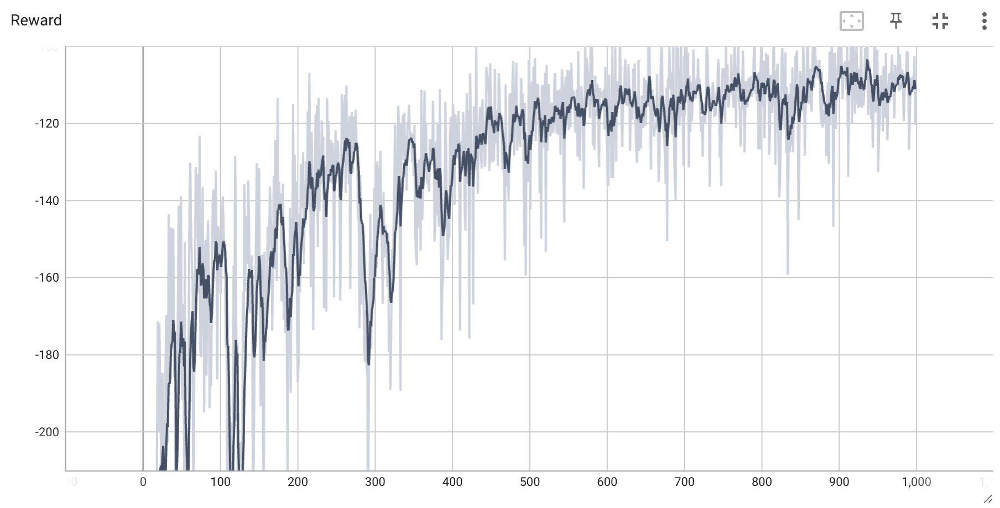
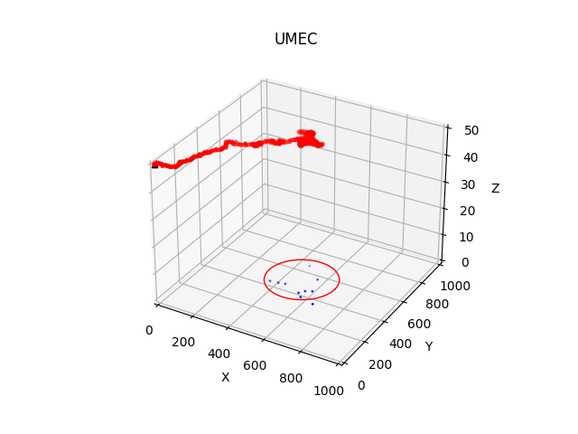

# 在自定义 UMEC 环境中基于 Pytorch 的 PPO 算法实现

## 简介

当前环境类似于单智能体的 [Pettingzoo Simple Spread](https://pettingzoo.farama.org/environments/mpe/simple_spread/)，包含一个无人机和多个呈现一定聚集性的用户。其中 Reward 被定义为无人机到用户聚簇中心的距离，从而鼓励它飞向用户密集的区域。由于只有一个无人机，不需要考虑碰撞约束。无人机仅在超出边界时获得固定惩罚，以满足边界约束。

## 主要依赖版本

- Python 3.8.19
- Numpy  1.24.4
- PyTorch 2.2.2
- OpenAI Gym 0.26.2

## 部分实验结果

环境奖励随训练次数的变化曲线

无人机移动轨迹
